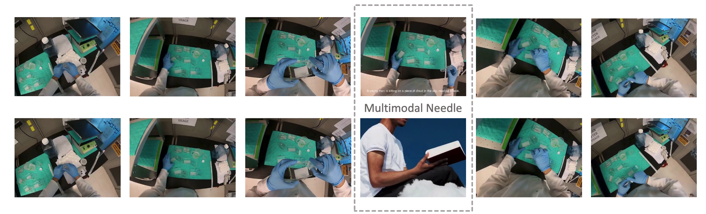
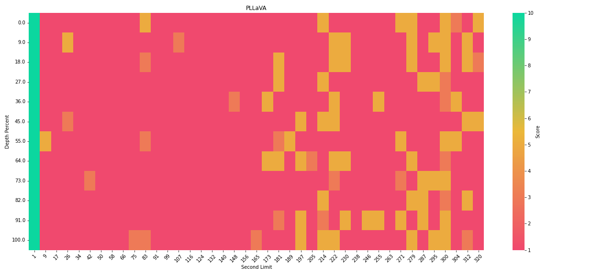
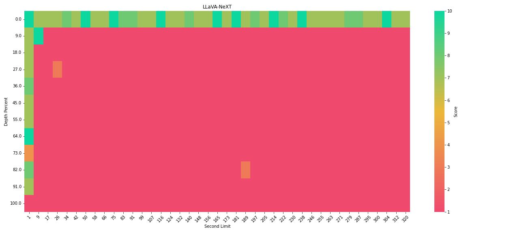
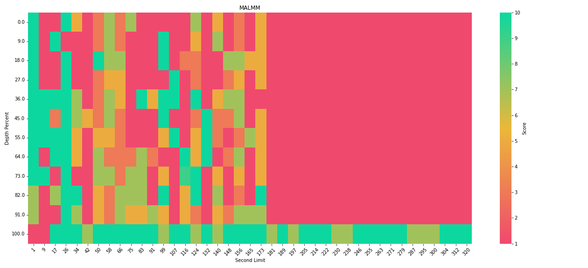

<div align="center">

# Multimmodal Needle In A Video Haystack

<!-- []() -->
<!-- [](https://arxiv.org/abs/<INDEX>)
[](https://<CONFERENCE>) -->

</div>




**Table of Contents**

- [Introduction](#introduction)
- [Getting Start](#getting-started)
    - [Install](#install)
    - [Run Test](#run-test)
    - [Visualization](#visualization)
- [Evaluation Results](#evaluation-results)
- [Acknowledge](#acknowledge)


## Introduction

To address existing limitations in long-form video language understanding benchmarks, our work takes inspiration from the latest developments in the field and develops a new benchmark specifically designed for the task of identifying specific content within extensive video material, a challenge we refer to as the Multimodal Needle In A Video Haystack (NIAVH). This benchmark is unique in that it supports queries in various modalities, including text, image, and video, allowing for a more comprehensive assessment of a model's video understanding capability.

In our benchmark, we utilize ego-centric videos from the Ego4D dataset as the "haystack". Within this haystack, we seek to locate the "needle", which we provide in three distinct modalities. For the textual modality, we supply a crafted description. For the image modality, we employ DALL-E to create an image that visually represents this description. For the video modality, we use Sora to generate a short video clip based on the same description. In each case, the "needle" - whether text, image, or video - is set to a duration of 1 second


## Getting Started

Currently support models: 

- GPT4O (Azure only support 20 frames), 
- [LLaVA-NeXT-Video-DPO](https://github.com/LLaVA-VL/LLaVA-NeXT/blob/inference/docs/LLaVA-NeXT-Video.md)
- [PLLaVA](https://github.com/magic-research/PLLaVA)
- [MA-LMM](https://github.com/boheumd/MA-LMM)


Installation

- GPT4O (Azure) 
    - create .env file, then add `API_BASE` and `API_KEY`
    - install `numpy`, `opencv-python`
- LLaVA-NeXT-Video:
    - install environment following its instruction
    - download checkpoint into `needlehaystack/baselines/checkpoints/LLaVA-NeXT-Video/LLaVA-NeXT-Video-7B-DPO`
- PLLaVA
    - install environment following its instruction
    - download checkpoint into `needlehaystack/baselines/checkpoints/PLLaVA/pllava-7b`
- MA-LMM
    - install environment following its instruction
    - download checkpoint into `needlehaystack/baselines/checkpoints/MA-LMM`, including `vicuna-7b-v1.1`, `eva_vit_g.pth`, `instruct_blip_vicuna7b_trimmed.pth`


### Install

Install the additional package in the model to be tested environment:

```zsh
pip install -r requirements.txt
```

### Run Test


single needle debug
```bash
python -m needlehaystack.run --provider GPT4O --video_depth_percents "[50]" --context_lengths "[10]"
```

pressure test
```bash
python -m needlehaystack.run --provider GPT4O
```


parameters

- `provider` - currently support model: `GPT4O`, `LLaVA-NeXT`, `PLLaVA`, `MA-LMM`
- `evaluator_model_name` - currently support evaluation API: `gpt-35-turbo-0125`
- `needle` - needle, could be string, video name, or image
- `needle_modality` - currently support `text`, `image`, `video`
- `needle_desc` - required for image or video needle (question answer)
- `retrieval_question` - required for image or video needle (question)
- `needle_dir` - required for image or video needle (directory to save needle)
- `haystack_dir` - required for image or video haystack (directory to save haystacks)
- `context_lengths` - video context length
- `video_depth_percents` - needle percent
- `context_lengths_min` - The minimum length of the context. Default is 1 seconds.
- `context_lengths_max` - The maximum length of the context. Default is 320 seconds.
- `context_lengths_num_intervals` - The number of intervals for the context length. Default is 40.
- `video_depth_percent_min` - The minimum depth percent of the document. Default is 0.
- `video_depth_percent_max` - The maximum depth percent of the document. Default is 100.
- `video_depth_percent_intervals` - The number of intervals for the document depth percent. Default is 12.


*note:* you can add more videos into `needlehaystack/haystack` directory to get longer video


### Visualization

use the `viz/visualization.ipynb` to visualize your result


## Evaluation Results

Given the limitations of current methods in understanding long videos, we designed an experiment where the "haystack" is a 320-second video. The "needle" is a 1-second video clip generated by Sora, prompted by the description, "the young man seated on a cloud in the sky is reading a book". The associated question posed for the experiment is, "What is the young man seated on a cloud in the sky doing?". We divided the context into 40 intervals and set the video depth at 12 intervals. 


### PLLaVA-7B (Run 6/5/2024)



### LLaVA-NeXT-Video-DPO-7B (Run 6/5/2024)



### MA-LMM (Run 6/5/2024)




## Acknowledge

This code is heavily built on [LLMTest_NeedleInAHaystack](https://github.com/gkamradt/LLMTest_NeedleInAHaystack). Many thanks to them for their work.

## Citation

```bibtex
@article{mm-niavh,
    title={Multimodal Needle in A Video Haystack},
    author={Wang, Yuxuan and Xie, Cihang and Liu, Yang and Zheng, Zilong},
    journal={github},
    year={2024}
}
```